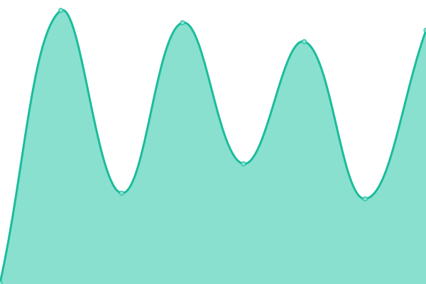

# [📈 Live Status](https://status.trinum.xyz): <!--live status--> **🟩 All systems operational**

This repository contains the open-source uptime monitor and status page for [Jose Duarte](trinum.xyz), powered by [Upptime](https://github.com/upptime/upptime).

With [Upptime](https://upptime.js.org), you can get your own unlimited and free uptime monitor and status page, powered entirely by a GitHub repository. We use [Issues](https://github.com/saert3311/upptime/issues) as incident reports, [Actions](https://github.com/saert3311/upptime/actions) as uptime monitors, and [Pages](https://status.trinum.xyz) for the status page.

<!--start: status pages-->
<!-- This summary is generated by Upptime (https://github.com/upptime/upptime) -->
<!-- Do not edit this manually, your changes will be overwritten -->
<!-- prettier-ignore -->
| URL | Status | History | Response Time | Uptime |
| --- | ------ | ------- | ------------- | ------ |
|  [trinum](https://trinum.xyz) | 🟩 Up | [trinum.yml](https://github.com/saert3311/upptime/commits/HEAD/history/trinum.yml) | 

 157ms
     
 | 

<a href="https://status.trinum.xyz/history/trinum">100.00%</a>
    

|  [MIASFR](https://miamiscaffoldrental.com) | 🟩 Up | [miasfr.yml](https://github.com/saert3311/upptime/commits/HEAD/history/miasfr.yml) | 

 411ms
     
 | 

<a href="https://status.trinum.xyz/history/miasfr">100.00%</a>
    

|  [Grexi](https://grexialbornett.com) | 🟩 Up | [grexi.yml](https://github.com/saert3311/upptime/commits/HEAD/history/grexi.yml) | 

 400ms
     
 | 

<a href="https://status.trinum.xyz/history/grexi">100.00%</a>
    

|  [Conferencia Grexi](https://conferencia.grexialbornett.com) | 🟩 Up | [conferencia-grexi.yml](https://github.com/saert3311/upptime/commits/HEAD/history/conferencia-grexi.yml) | 

 253ms
     
 | 

<a href="https://status.trinum.xyz/history/conferencia-grexi">100.00%</a>
    

|  [Everglades Services](https://everglades.services) | 🟩 Up | [everglades-services.yml](https://github.com/saert3311/upptime/commits/HEAD/history/everglades-services.yml) | 

 313ms
     
 | 

<a href="https://status.trinum.xyz/history/everglades-services">100.00%</a>
    

|  [n8n Server](https://n8n.trinum.xyz/healthz) | 🟩 Up | [n8n-server.yml](https://github.com/saert3311/upptime/commits/HEAD/history/n8n-server.yml) | 

 182ms
     
 | 

<a href="https://status.trinum.xyz/history/n8n-server">99.90%</a>
    

<!--end: status pages-->

[**Visit our status website →**](https://status.trinum.xyz)

## 📄 License

- Powered by: [Upptime](https://github.com/upptime/upptime)
- Code: [MIT](./LICENSE) © [Jose Duarte](trinum.xyz)
- Data in the `./history` directory: [Open Database License](https://opendatacommons.org/licenses/odbl/1-0/)
